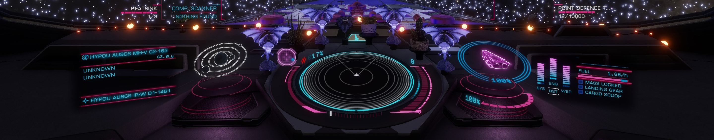

`Ambient.Impact.Synth` theme for the [Elite Dangerous HUD
Mod](https://github.com/psychicEgg/EDHM). I recommend using
[EDHM_UI](https://github.com/BlueMystical/EDHM_UI) to install and manage themes.

# Installation

The preferred installation method is via EDHM_UI; download the contents of this
repository as a ZIP file and then import it via EDHM_UI and it'll handle the
rest.

## Manual installation

### Windows

Download and copy the contents of this repository to:

```
C:\Users\<user>\EDHM_UI\ODYSS\Themes\Ambient.Impact.Synth
```

replacing `<user>` with your Windows user account.

o7
