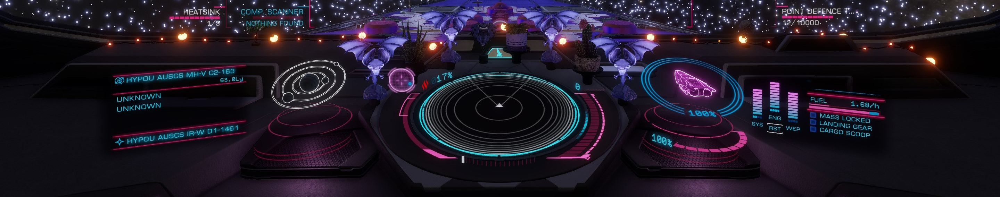

`Ambient.Impact.Synth` theme for the [Elite Dangerous HUD
Mod](https://github.com/psychicEgg/EDHM). I recommend using
[EDHM_UI](https://github.com/BlueMystical/EDHM_UI) to install and manage themes.

# Installation

The preferred installation method is via EDHM_UI; download the contents of this
repository as a ZIP file and then import it via EDHM_UI and it'll handle the
rest.

## Manual installation

### Linux

If you've followed [my guide and used my script to install EDHM UI via
Bottles](https://ambientimpact.com/gaming/elite-dangerous/edhm-ui-on-linux-using-bottles),
and you haven't changed the default theme location, it should be copied to:

```
$BOTTLE_PATH/drive_c/users/steamuser/EDHM_UI/ODYSS/Themes/Ambient.Impact.Synth
```

Where `$BOTTLE_PATH` is the path to the bottle. If you don't know where that is,
open Bottles, click on the EDHM UI bottle, click the three dot menu (...) in the
header, and choose "Browse Files" which should open at `$BOTTLE_PATH/drive_c/`
and you can find your way from there.

### Windows

If you haven't changed the default theme location, this theme should be copied
to:

```
C:\Users\<user>\EDHM_UI\ODYSS\Themes\Ambient.Impact.Synth
```

replacing `<user>` with your Windows user account.

----

# o7
